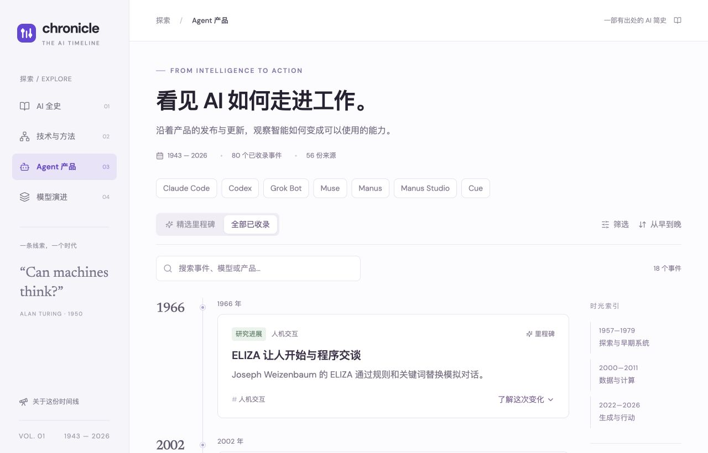
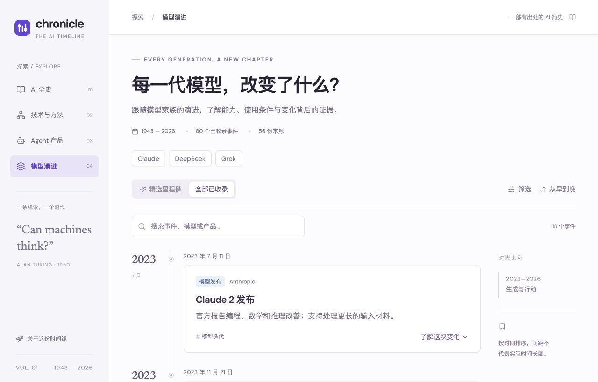

# 当前版阅读与覆盖检查

日期：2026-09-29。目标：让读者快速看到全球 AI 技术、模型与 Agent 应用的关键进展。截图取自本轮对本地现有版本的实际访问，文件已保存并检查。

## 1. 全史首页，小屏

状态：可读，但浏览效率低。

优点：日期、标题、摘要与展开入口明确。问题：到第一个节点前已使用大量垂直空间，一个屏幕只能阅读极少事件；难以形成历史概览。改进：缩短页头，压缩默认节点，把长说明放到选择后的详情。

可访问性风险：部分浅色标签与低对比文字难以快速辨认。本次截图不足以判断 WCAG 合规，仍需计算对比度并验证键盘和读屏。

## 2. Agent 专题，桌面

状态：入口可发现，但分类边界混杂。

优点：产品筛选可见。问题：页面以 Agent 产品命名，却首先展示 ELIZA；产品范围还混入早期机器人。旧系统应归入 AI 全史或背景，Agent 应用主线聚焦可执行任务的现代产品。标题区、导航和搜索合计占较多空间，第一条事件出现偏晚。

## 3. 模型专题，桌面

状态：版本条目结构可用，全球覆盖不足。

当前只提供 Claude、DeepSeek、Grok 三个模型家族。数据检查显示 18 条模型事件中有 12 条是 Claude。这会让读者误以为模型发展主要由这几条路线构成。需要补 GPT、Gemini、Llama、Qwen、Kimi、GLM 等，并将常规更新置于第二层。

三步共同的设计问题：列表被大卡片切碎，时间、模型与应用关系难以同屏比较。建议用同一时间上下文下的三条主题视图，或紧凑的统一编年索引。

检查边界：此次是限定页面的截图与内容结构检查；未进行完整可用性研究、全站无障碍认证或所有外链检查。
