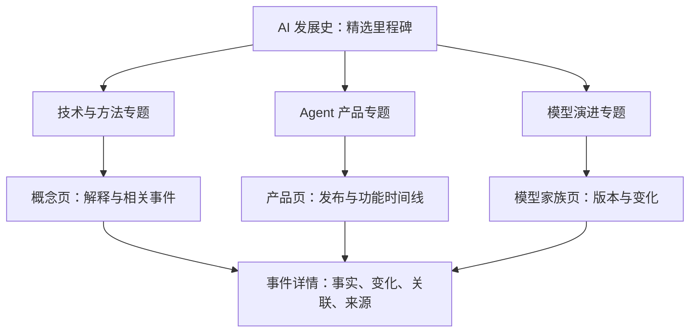

# 多维 AI 发展史：补充调研与 MVP 方案

日期：2026-09-29。状态：用户已确认开始实施，首版实现见项目 README；以下保留设计依据。

## 1. 产品结构的调整

建议改为“一条历史主线，三个专题维度，同一套可核查的事件库”：

- AI 全史：对普通读者展示跨年代的重要里程碑。
- 技术与方法：Prompt、工具使用、Agent、Skills、上下文工程、Harness、Loop 等如何被提出、实现和采用。
- Agent 产品：产品首次亮相、开放使用、关键能力发布、形态变化和重大版本。
- 模型演进：模型家族、版本发布、与指定前代相比的能力和代价变化。

“全史”是精选视图，三个专题也可以交叉。一条事件可以出现在多个视图中，但只存储和维护一次。

这里有三个独立维度：看什么（专题/对象）、看哪段时间（年代/年/月）、看多细（里程碑/主要更新/全部收录）。不要用一个分类下拉框同时承担三件事。

## 2. 先澄清方法、机制和历史顺序

用户给出的 Prompt → Skills → Agent → Harness → Loop 很适合表达想关注的方向，但不宜直接呈现为确定的发明顺序或替代路线。

| 对象 | 本站给大众的简明解释 | 应记录的历史节点 |
| --- | --- | --- |
| Prompt engineering | 如何表达任务、提供示例与约束 | 有明确出处的论文、方法或工具发布 |
| Agent | 能根据任务与环境反馈选择下一步行动的系统 | 代表性架构、系统实现和应用突破 |
| Skills | 将任务知识、操作流程和资源打包，供 Agent 使用 | 特定格式提出、标准开放、产品支持 |
| Harness | 围绕模型组织工具调用、上下文、执行与恢复的运行框架；边界随实现而异 | 公开架构、工程方法、SDK 或运行时发布 |
| Loop | 执行、观察、检查、继续或停止的循环机制 | 具体算法、实现和长任务改进，不设泛称的单一诞生日 |

查证依据：

- [ReAct 原论文](https://arxiv.org/abs/2210.03629)于 2022-10-06 首次提交，交替组织推理与行动。它是相关方向的代表节点，不作为所有 Agent 或循环机制的最早起源。
- [Anthropic 的 Building Effective Agents](https://www.anthropic.com/engineering/building-effective-agents)发表于 2024-12-19，将 Agent 描述为依据环境反馈循环使用工具的系统，并区分预定义工作流和自主 Agent。
- [Anthropic Agent Skills](https://www.anthropic.com/engineering/equipping-agents-for-the-real-world-with-agent-skills)于 2025-10-16 发布，文章另记载 2025-12-18 开放标准。这里指具体的 Agent Skills 方案，不能推断此前不存在泛称的技能、插件或可复用指令。
- [长任务 Harness 工程文章](https://www.anthropic.com/engineering/effective-harnesses-for-long-running-agents)发表于 2025-11-26，讨论跨上下文窗口工作的机制。这是文章和方案的公开日期，不是 Harness 概念诞生日期。
- [OpenAI Agents API 架构文档](https://developers.openai.com/api/docs/guides/agents-api/architecture)把 Harness 描述为运行模型与工具循环、维护会话的组成部分。该当前文档用于解释概念，不用于反推历史首次发布日期。

因此建议页面分成两层：一条可核实的事件时间线；一块解释“使用、组成、支持、关联”的概念关系区。编辑推断单独标明，不用时间先后证明因果关系。

## 3. 用户怎样浏览

主导航保留四个入口：全史、技术与方法、Agent 产品、模型演进。它们共用时间线布局和事件详情组件。

交互建议：

1. 首次进入全史，只显示约 20–30 个关键节点。阅读方向默认从早到晚。
2. 从某个节点进入 Agent 专题时，保留当前时间范围；支持一键切换到专题全时段，避免误以为范围外没有事件。
3. 专题可选择公司、产品或模型家族；筛选后明显显示已选条件、结果数和收录截止日。
4. 进入某个产品，看到该产品自己的首次发布、正式开放和重大更新；可切到最新优先查看近期变化。
5. 进入某个模型版本，查看“相比哪个版本，哪些能力改变，代价如何，证据是什么”。
6. 事件页提供相关方法、相关产品、相关模型的跳转，以及原始来源。

年代视图按年组织，近年专题按月组织，月内展开具体日期。粒度改变用于聚合和展开事件，不要求首版实现连续缩放画布。聚合节点显示事件数，不能静默隐藏条目。

手机使用一列卡片＋专题切换。桌面也以纵向列表为主；同一时间段的多轨并排对照可后续增加。暂不同时放出十几条横向轨道。

## 4. 产品线必须区分“产品”和“发布事件”

Claude Code、Codex、Manus 等应是独立对象，各有自己的发布历史。产品之间按时间并列展示，不把 A → B 的先后关系当作 B 继承了 A。

产品页建议展示：名称、公司、类别、运行形态、首次公布时间、首次可用时间、重大更新列表和来源。公司归属、支持模型、默认模型等可能变化，应记录生效时间和证据。

产品类别可先用编码 Agent、通用任务 Agent、研究 Agent、创作/应用构建四种；按证据允许一个产品属于多种。

发布事件类型包括：宣布、研究预览、公开测试、正式可用、新平台、重大功能、停用。界面默认显示重要发布，常规小更新折叠。

真实例子：

- [2025-02-24 的公告](https://www.anthropic.com/news/claude-3-7-sonnet)同时发布 Claude 3.7 Sonnet，并介绍 Claude Code 的有限研究预览。应拆为模型发布和产品预览两个事件，共享来源和发布组。
- [2025-05-22 的公告](https://www.anthropic.com/news/claude-4)同时发布 Claude 4 模型并宣布 Claude Code 正式可用。不能把产品正式可用日当作它的首次出现日。
- [Manus 1.6 发布公告](https://manus.im/en/blog/manus-max-release)介绍 Agent 架构与产品功能变化。产品名中出现版本号，并不自动意味着它是一个新的底层基础模型。

本轮未完成各产品的全量历史核验。用户随后提供官网，已确认对象为 Grok Bot、Muse、Manus Studio 和 Cue。具体依据如下，产品能力为官网描述，未进行产品实测：

| 对象 | 核查结果 | 对时间线结构的启发 |
| --- | --- | --- |
| [Grok Bot](https://x.ai/bot) | 官网强调持续云电脑、多 Bot 协作和例行任务；[官方更新日志](https://docs.x.ai/developers/release-notes)在 2026 年 8 月 11 日记录开放 | 产品与 Grok 模型分开；增加持续运行、协作等能力标签 |
| [Muse](https://muse.ai/) | 公开主页由浏览器读取；[2026 年 9 月的官方设计说明](https://introducing.muse.ai/)强调个人 Agent、云电脑、长期目标和主动跟进 | 可归入个人助理及长期任务；设计文章只有月份，不据此编造精确首发日 |
| [Manus Studio](https://manus.im/zh-cn/blog/introducing-manus-2-0) | Manus 2.0 公告将桌面应用升级为 Studio | 记录产品形态变化，挂在 Manus 产品体系下 |
| [Cue](https://cue.im/) | 公开主页介绍具备电话、邮箱、钱包和电脑的个人 Agent；Manus 2.0 公告明确它是共享基础设施的独立应用 | 独立产品实体，与 Manus 建立有来源的关系 |

Manus 2.0 公告还介绍 Cascade Agent 框架，因此一次发布至少要关联技术框架、桌面工作空间和独立应用等对象。公告中框架性能的数字属于厂商在特定配置中的报告，不归到基础模型得分中。该公告页面显示 9 月 28 日；精确年份等完整发布元数据入库前再核验。

工作方式标签建议先选：编码、协作创作、个人助理、后台持续运行、定时/事件触发、多 Agent 协作。它们是可叠加标签，不是互斥的产品等级或进化阶段。对未披露的能力标为未知，不能默认不支持。

## 5. 模型线的核心是“版本变化卡”

模型页要回答用户“这次提升了什么”，而不是只列发布日和型号。

| 内容 | 展示要求 |
| --- | --- |
| 比较基线 | 明确本次与哪个家族、档位、版本或快照比较；没有直接前代时不强行指定 |
| 一句话变化 | 用读者能理解的任务解释本次更新意义 |
| 能力变化 | 推理、编程、工具使用、多模态、长上下文等，只显示有来源的项 |
| 新增功能 | 输入/输出模态、结构化输出、工具能力等；区分模型能力与 API/产品功能 |
| 代价与限制 | 价格、响应时间、计算预算、可用范围、已知退步；未公开就标明未披露 |
| 量化依据 | 指标、旧值、新值、单位、数据集版本、测试配置、来源与测试日期 |
| 发布状态 | 预览、正式、停用；API 可用与聊天产品开放可以是不同日期 |

例：Claude Sonnet 4 对 Sonnet 3.7 的变化卡，可以记录“官方报告编程、推理和指令遵循改善”，并记录支持在 extended thinking 中使用工具等变化。[官方发布材料](https://www.anthropic.com/news/claude-4)还明确列出不同评测的计算设置、工具框架和样本差异；不能将所有表格里的分数都视为同条件实验。

证据分为三类：厂商报告、第三方评测、本站分析。每项结论绑定来源，不给整个版本笼统盖上“已验证更强”的印章。

相同测试名称不足以判定可比。比较必须关注数据集/子集、版本快照、推理预算、工具与 Harness、尝试次数、指标口径。条件不一致时可并列展示，但不计算误导性的提升百分比。

对性能百分数，区分百分点变化和相对提升；不把“编程得分改善”写成“所有任务全面提升”。价格与延迟也需绑定日期、服务渠道、缓存/批处理口径和测试条件。

模型实体层级建议为：公司 → 模型家族 → 具体版本/档位 → 必要时展开快照。preview 到正式版、同名版本的新快照单独记录；不同档位之间不是单一线性升级关系。

## 6. 共用数据，而不是三份互相复制的年表

首版建议用五类内容集合，以稳定 ID 关联：

| 集合 | 保存什么 |
| --- | --- |
| entities | 组织、概念、产品、模型家族及具体版本；使用 type 区分 |
| events | 某时点发生的变化；日期精度、事件类型、关联对象、里程碑级别、发布组 |
| sources | 论文、公告、changelog、评测；作者/机构、发布日期、访问日期、URL |
| relations | 对象间的关系，例如 belongs_to、supports、uses、supersedes；来源与有效时间 |
| changes | 本次相对指定基线的变化；定性描述或指标、限制、证据类别与来源 |

对象回答“它是什么”，事件回答“什么时候发生什么”，changes 回答“比之前变了什么”。一个模型版本可以关联宣布、开放 API、停用等多个事件。

一篇公告可以对应多个事件；多个事件可共享 announcementGroupId。全史按发布组适当合并摘要，专题中展示各自相关事件，避免同日整页都是重复公告。

需要时把复杂指标抽成 evaluations 集合；MVP 可先放在 changes 的结构化指标字段，不必一开始建设通用评测平台。

关系需区分：支持某模型、默认使用某模型、发布时使用某模型、可自选模型。来源未公开就不补全。关系箭头只表达明确标签，不用来暗示技术因果。

不需要图数据库。普通内容文件和 ID 关联足以承载首版规模，构建时校验重复 ID、失效引用、日期、缺少来源和版本比较基线。

## 7. 对技术方案的影响

继续建议 Astro＋TypeScript＋结构化内容，交互密集的时间线筛选/详情部分可采用 React 组件；按官网支持的 UI 集成方式实施时再核查具体配置。

新增维度本身不要求后端。静态生成概念页、产品页、模型版本页，在浏览器完成筛选与切换即可。只有多人在线编辑、账户、收藏同步或服务端采集成为明确需求时再引入数据库和服务端。

建议 URL：

- `/ai/`：全史。
- `/ai/agents/`：Agent 专题，可同时筛选方法与产品。
- `/ai/concepts/<slug>/`：概念说明与相关历史。
- `/ai/products/<slug>/`：单产品发展史。
- `/ai/models/<family>/`：家族版本线。
- `/ai/models/<family>/<version>/`：版本变化详情。
- `/ai/events/<slug>/`：可分享的事件。

时间范围、轨道、公司、里程碑级别与排序保存在 query 参数中；事件和实体使用独立 URL。切换专题、刷新、返回时保留状态。语言方案仍待确认，不先绑定中文路由。

## 8. 修订后的 MVP 范围

此前只做 40–60 条通史的方案不足以同时验证产品线和模型版本线。建议保留小范围，但四个入口和三类详情在首版都存在：

- 全史精选约 20–30 个主线节点，跨年代完整覆盖。
- 技术与方法选择约 8–12 个概念，记录有来源的代表事件。
- Agent 产品首批覆盖用户点名的 Claude Code、Codex、Grok Bot、Muse 和 Manus 产品体系（含 Studio、Cue），以约 5–7 个产品对象为范围，核查首次发布及主要能力更新。
- 模型先选 3 个家族，覆盖明确起止范围内的主要公开版本；预览和快照按规则归组，不承诺全行业全版本。
- 独立事件总量可先以约 80–120 条作为工作量预算，按实际选题去重后调整；不是已完成的数据量或硬性填充目标。

主线节点是全库的精选子集，不额外复制。各专题标注实际覆盖范围、最后核查时间；“全部”应写成“全部已收录事件”，不能给人全行业穷尽的印象。

第一版模型变化以结构化文字和有来源的指标为主；自动跨厂商排行榜、任意两模型比较器、所有产品日更、复杂知识图谱后置。

内容工作会明显增加，优先做 10–15 个混合样例验证结构：同一公告发布多个对象、产品预览到正式开放、不同模型档位、未知日期、非可比评测和多个来源。方案确认后先审样例，再扩写全库。

## 9. 增加的验收场景与维护要求

1. 用户能从历史主线进入 Agent 专题，并追踪单个产品而不丢失时间位置。
2. 同一事件在多个视图中标题、日期和来源一致。
3. 一个公告的模型发布与产品发布可分别找到，也能看出它们同属一次公告。
4. 产品版本和基础模型版本清楚区分。
5. 每条版本变化注明比较基线、证据和必要的测试条件；未知值不显示为零。
6. 时间聚合后仍能展开全部已收录事件，筛选范围和空结果可理解。
7. 产品更名、模型停用、来源修正保留历史记录，不用当前状态覆盖历史事实。

后续维护建议：研究人员从官方 changelog、公告和论文发现候选，先进入待审列表，核实后发布。自动采集只作为后续可选辅助，不在本轮创建定时任务或自动发布流程。

## 10. 当前需要确认

- 是否采用“全史入口＋技术方法、Agent 产品、模型演进三条专题”的信息结构。
- 产品对象已由用户官网链接澄清；待确定的是各产品历史的收录深度和首批模型家族。
- 展示语言仍待确认；全球 AI 历史的内容范围已明确。

本轮可以先确认信息结构，不必立即敲定全部型号、厂商或开发框架。下一步应是准备混合样例和页面结构草图，得到确认后再开始工程实施。
