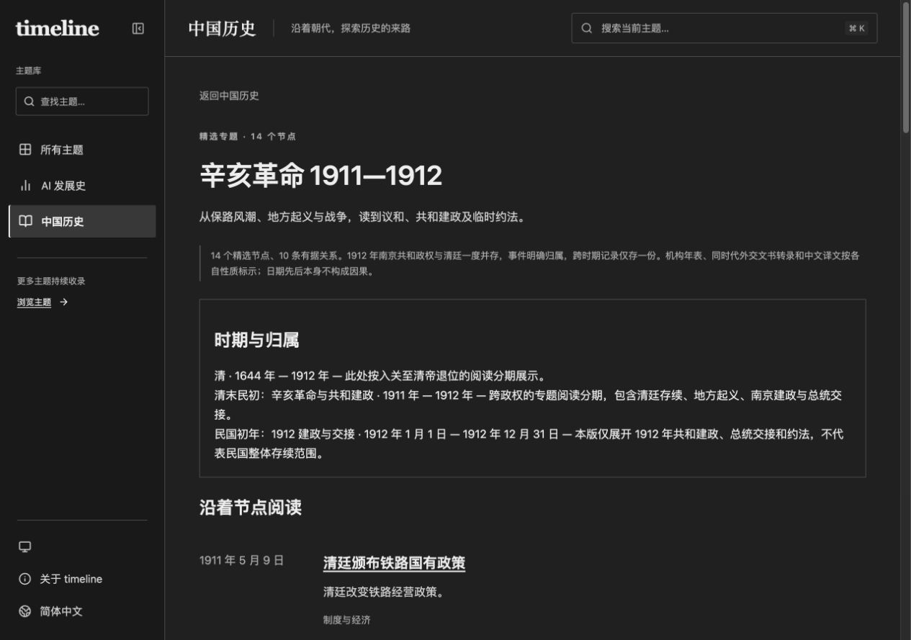

# 辛亥革命 1911—1912 实施与验收

完成日期：2026-10-09。所有内容已写入当前工作区；未提交、推送、合并或部署。保留任务开始时的用户未提交变更，没有清理或回滚；原有服务没有停止。

本机预览正在运行：[中国历史入口](http://127.0.0.1:4327/china-history/) · [辛亥专题](http://127.0.0.1:4327/china-history/collections/xinhai-1911-1912/)。Chrome 已保留专题预览标签页。如预览进程之后结束，可在项目目录运行 `npm run preview -- --port 4327 --ignore-lock`，使用已生成的根路径 `dist`。

## 新旧统计

| 中国历史 | 实施前 | 实施后 |
| --- | ---: | ---: |
| 朝代／阅读时期 | 34 | 36 |
| 事件 | 20 | 34 |
| 对象 | 28 | 41 |
| 来源 | 14 | 29 |
| 对象关系 | 0 | 0 |
| 事件证据关系 | 0 | 10 |
| 精选专题 | 0 | 1 |

AI 内容数量保持 245 事件、78 对象、201 来源、6 条对象关系、12 条事件证据关系、1 个 14 节点专题。10 条辛亥关系均使用事件证据关系结构，其中 3 条连接事件、7 条连接人物／机构；这 7 条不混入旧 AI 对象关系结构的统计。

## 实际变更文件

相对于任务开始时的工作区，而非相对于 Git HEAD：

| 文件 | 变更 |
| --- | --- |
| `src/topics/china-history/xinhai.ts` | 新增 14 事件、13 对象、15 来源、10 关系与专题定义 |
| `src/topics/china-history/catalog.ts` | 接入专题、来源和对象；新增两个有限阅读分期及可发现入口 |
| `src/pages/china-history/collections/xinhai-1911-1912.astro` | 复用既有专题组件 |
| `src/pages/china-history/objects/[slug].astro` | 专题人物／机构的参与记录、事件、关系和来源页面 |
| `src/pages/china-history/events/[slug].astro` | 接入段落来源、关系和对象链接；日期精度按实际数据表达 |
| `src/core/evidence.ts` | 共用关系端点解析，保留已记录的主体到客体方向 |
| `src/components/timeline/Relations.astro` | 完整主体—关系—客体展示 |
| `src/components/timeline/Explorer.tsx` | 修复反向关系；来源目录包含关系证据 |
| `scripts/validate.ts` | 分开输出对象关系、事件证据关系与专题数量 |
| `tests/xinhai.test.ts` | 3 项专题完整性、阶段日期和双主题反向关系回归测试 |
| `src/pages/about.astro` | 更新历史范围及分类统计 |
| `README.md` | 更新历史／AI 数据统计与专题说明 |
| `docs/xinhai-coverage.md`、`docs/verification-xinhai/` | 本记录、运行日志与 Mac Chrome 截图 |

`evidence.ts` 和 `Relations.astro` 在任务开始时已经是用户未跟踪文件，本次在其基础上增量修改。没有将它们当作空白文件替换。专题组件、既有 AI 数据、样式及依赖配置均继续使用已有实现。

## 日期、阶段与分期

| 事件 | 展示日期或阶段 |
| --- | --- |
| 铁路国有政策 | 1911-05-09 |
| 四川保路运动：组织与抗议阶段 | 06-17 至 09-07；终点只是阶段边界 |
| 成都血案 | 09-07；不引入未核验伤亡数字 |
| 武昌起义 | 10-10；与 10-11 电报及军政府成立区分 |
| 湖北军政府成立 | 10-11 |
| 阳夏战争 | 10-18 至 11-27，采用博物院年表分期；正文另记 10-16 已有交战 |
| 上海起义与沪军都督府 | 11-03 起义、11-06 建府 |
| 南京光复 | 12-02；正文区分 12-03 选址 |
| 上海议和阶段 | 12-18 至 1912-01-02；此后转为直接电商，非整个议和终结 |
| 孙中山当选 | 12-29；不采用 FRUS 的全体一致票数概括 |
| 孙中山就任与南京建政宣告 | 1912-01-01；正文分别说明 01-03 组成阶段与 01-05 对外宣言 |
| 清帝退位 | 02-12；02-13 外交报告为次日转述 |
| 袁世凯当选、就任与交接 | 02-15 当选、03-10 北京就任、04-01 孙中山正式解职 |
| 临时约法 | 03-08 议决、03-11 公布；第 56 条规定公布日起施行 |

新增“清末民初”作为跨政权阅读分组，“民国初年”仅展开 1912 年建政与交接，不暗示民国或南京政府的完整存续范围。孙就任、袁交接、约法不归入清；跨年会谈和退位关联多个时期，但事件只保存一次。1912 年的并行与后续交接明确说明。

## 已读核的 15 份来源

本轮只为实际阅读过的以下来源设置 `checkedAt=2026-10-09`；原有 14 份历史来源保持原核查日期 2026-09-30。每段事实及每条关系均有来源 ID 和可定位条目，编辑概述单独标明。

| 来源 | 采用位置与核验边界 |
| --- | --- |
| [辛亥革命年表](https://1911museum.cn/list_30.html) | 1911-05-09 至 1912-04-05 相关日期条目；博物馆编纂年表 |
| [武昌起义大事记](https://1911museum.cn/list_31.html) | 10-16、10-18、11-03、11-27、1912-04-01；注明节录《辛亥武昌首义史》，未核验书本原件 |
| [嘱陈其美促伍廷芳等到宁视事电](https://sunology.yatsen.gov.tw/detail/74f4fd127b7dd1fac4fb3d2dfa0808aa/) | 1912/01/03 全文、注一、《国父全集》第四册 p174；据《天铎报》的函电文本转录 |
| [粤汉铁路湘鄂线修筑略记](https://daj.yueyang.gov.cn/6658/6667/content_370337.html) | 第二节政策与抗议段；只采用 1911 年部分 |
| [共和之基——辛亥革命历史陈列](https://www.1911museum.cn/view_59.html) | 第三展厅“武昌首义”、第四展厅“创建共和”；陈列说明 |
| [FRUS 第 23 号文书](https://history.state.gov/historicaldocuments/frus1912/d23) | 1911-09-03 正文首段；外交电报摘录与转述 |
| [FRUS 第 28 号文书](https://history.state.gov/historicaldocuments/frus1912/d28) | 1911-10-11 正文首段；武昌占领及领事回应 |
| [FRUS 中国革命章](https://history.state.gov/historicaldocuments/frus1912/ch11) | 章首 Note；文献集编者说明，非单份同时代电报 |
| [FRUS 第 67 号文书](https://history.state.gov/historicaldocuments/frus1912/d67) | 第 2–4 段与脚注 1；附件未刊出，不能声称退位诏书原件已核验 |
| [FRUS 第 71 号文书](https://history.state.gov/historicaldocuments/frus1912/d71) | 1912-02-16 正文“yesterday”；选举、邀请赴南京 |
| [FRUS 第 85 号文书](https://history.state.gov/historicaldocuments/frus1912/d85) | 1912-03-09 授权次日北京就任；就任结果另由章首 Note 互证 |
| [对外宣言书（英译中）](https://sunyat-sen.org/portal/article/index.html?cid=19&id=24415) | 撰写时间、原载、第（一）至（四）项、文末；01-05 宣言中文译文，页面称英文原文未发现 |
| [临时约法及公布令固定转录版](https://zh.wikisource.org/w/index.php?title=中華民國臨時約法&oldid=2422419) | 公布令、第 2、5、16、22、43–45、51、54、56 条；含后加标点，未核验公报原件 |
| [临时约法颁布日期回顾](https://www.bj148.org/wh/lssdjt/202103/t20210311_1601353.html) | 首段 03-08、末段 03-11；只采用日期，不照录其内阁制度概括 |
| [临时约法展品说明](https://www.sunyat-sen.org/portal/article/index.html?cid=215&id=26806) | 参议院通过、孙中山公布、主权与平等说明；未据图片核验实物全文 |

以上是网页、转录及译文核验，不等于核验馆藏、报纸、书本、诏书或公报原件。相关限制已经写入用户可见的来源版本和正文阅读边界。没有以时间相邻创造因果关系。

## 验收结果

| 检查 | 结果 |
| --- | --- |
| `npm run validate` | 通过；AI 与中国历史数量、引用及关系校验成功 |
| `npm test` | 46/46 通过 |
| `npm run check` | 74 个 Astro 文件，0 错误、0 警告、0 提示 |
| 根路径 `npm run build` | 559 页成功 |
| 根路径 `npm run check:links` | 559 页、10,228 条内部链接通过 |
| `/timeline` 构建 | `TIMELINE_BASE_PATH=/timeline TIMELINE_OUT_DIR=dist-pages npm run build` 成功，559 页 |
| `/timeline` 链接 | 同环境运行 `npm run check:links`，10,228 条内部链接通过 |
| `git diff --check` | 通过 |
| Mac Chrome 桌面 | 从中国历史入口进入专题；14 节点、详情阶段、来源链接和完整反向关系正常 |
| Mac Chrome 外部来源 | 实际打开 01-03 函电网页，核对日期、正文、底本及 p174 |
| Mac Chrome 手机 | 375px 专题／约法详情／交互时间线、320px 专题／对象页；没有横向溢出 |
| 反向关系 | 孙就任详情完整显示“孙当选 → 当选者随后就任 → 孙就任”及“袁交接 → 临时总统职务接替 → 孙就任”；桌面和手机均验证 |

临时视口覆盖已恢复。根路径本机预览服务保留在 4327；没有停止其他服务。初次启动曾被沙箱禁止监听本机端口，随后获自动审批并成功启动，阻塞已解决。当前没有实施或预览阻塞。

运行日志保存在 `verification-xinhai/`。截图：

- [专题桌面](verification-xinhai/topic-desktop.jpg)
- [事件桌面](verification-xinhai/event-desktop.jpg)
- [桌面交互时间线](verification-xinhai/reader-relations-desktop.jpg)
- [专题手机](verification-xinhai/topic-mobile.jpg)
- [事件手机](verification-xinhai/event-mobile.jpg)
- [对象手机](verification-xinhai/object-mobile.jpg)
- [手机交互时间线](verification-xinhai/reader-mobile.jpg)

